# GKE Golden Path: Cymbal Bank Ledger Monolith Migration

## Overview

Cymbal Bank's primary online banking application is migrating to Google Cloud. Currently, the application has several microservices running on Google Kubernetes Engine (GKE) along with a monolith and database still running on virtual machines.

Migrating, optimizing, and modernizing the monolith and database will help Cymbal Bank to improve the performance and scalability of its online banking application. It will also help Cymbal Bank to take advantage of the latest features and services offered by Google Cloud.


### Migrate

- Migrate the database to a managed service. This can be done by using the Database Migration Service (DMS) to migrate the database to Cloud SQL.

- Migrate the monolith to GKE. This can be done by using Migrate to Containers (M2C) or by manually creating images and manifests.

### Optimize

- Optimize the application by rightsizing the pod's resource requests and limits base on metrics and recommendations.

- Optimize the database by rightsizing the instance based on metrics and recommendations.

### Modernize

- Modernize the database running on Cloud SQL, it can be modernized using tools like Cloud Spanner, Cloud Bigtable, or AlloyDB

- Modernize the monolith running on GKE, it can be tuned for performance and scalability, put into a CI/CD workflow, or decoupled into microservices.

### Existing Architecture

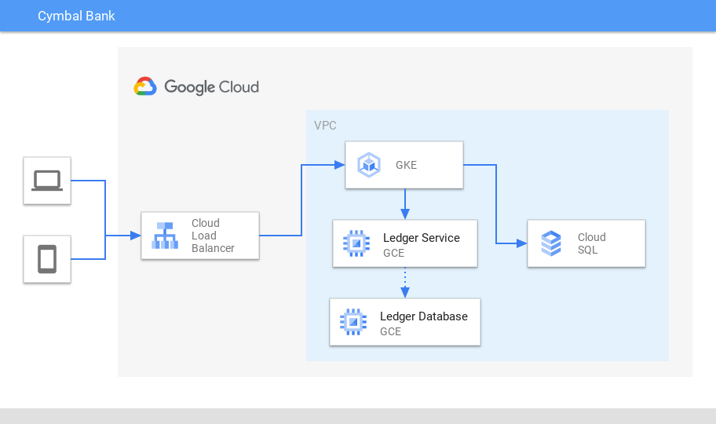

## Requirements

> This guide is meant to be run from CloudShell in the Google Cloud Console.

- Terraform `">= 1.3.5, < 2.0.0"`

### Bring your own (BYO) project

- New Google Cloud Project with no APIs enabled
- `default` auto mode network
- `roles/owner` IAM permissions on the project
- `iam.disableServiceAccountKeyCreation` enforcement disabled or `roles/orgpolicy.policyAdmin`

### Create a new project

- `roles/resourcemanager.projectCreator` IAM permissions on the folder specified
- `roles/billing.user` IAM permissions on the billing account specified
- `iam.disableServiceAccountKeyCreation` enforcement disabled after creation or `roles/orgpolicy.policyAdmin`

## Setup

- Clone the source repository

  ```
  git clone --branch gke-cymbal-bank --recurse-submodules https://github.com/GoogleCloudPlatform/golden-path.git && \
  cd golden-path
  ```

- Set the required environment variable

  ```
  export GKE_GP_BASE=$(pwd) && \
  echo "export GKE_GP_BASE=${GKE_GP_BASE}" >> ~/.bashrc
  ```

- Set the variables in the [application.auto.tfvars](terraform/shared/application.auto.tfvars) file

  ```
  vi ${GKE_GP_BASE}/terraform/shared/application.auto.tfvars
  ```

  ### Bring your own (BYO) project

  ```
  google_billing_account_id_application = ""
  google_folder_id_application          = ""
  google_project_id_application         = "<existing project id>"
  google_region_application             = "us-central1"
  google_zone_application               = "us-central1-a"
  ```

  - `google_billing_account_id_application`:Leave empty or remove
  - `google_folder_id_application`: Leave empty or remove
  - `google_project_id_application`: Google Cloud project ID of the existing project.
  - `google_region_application`: Set the default region for the resources.
  - `google_zone_application`: Set the default zone for the resources.

  ### Create a new project

  ```
  google_billing_account_id_application = "<billing account id>"
  google_folder_id_application          = "<folder id>"
  google_project_id_application         = ""
  google_region_application             = "us-central1"
  google_zone_application               = "us-central1-a"
  ```

  - `google_billing_account_id_application`: Billing account ID to attach the new project to.
  - `google_folder_id_application`: Folder ID to create the new project in.
  - `google_project_id_application`: Leave empty
  - `google_region_application`: Set the default region for the resources.
  - `google_zone_application`: Set the default zone for the resources.

- **[Optional]** Authenticate `gcloud` and set the application-default credentials

  > **NOTE**: Only run this step if you are not using CloudShell.

  ```
  gcloud auth login --activate --no-launch-browser --quiet --update-adc
  ```

- **[Optional]** Initialize the projects

  > **NOTE**: Only run this step if you do not have an existing project.

  ```
  cd ${GKE_GP_BASE}/terraform/000_initialize && \
  terraform init && \
  terraform plan -input=false -out=tfplan && \
  terraform apply -input=false tfplan && \
  rm tfplan
  ```

- Configure `gcloud` default project

  ```
  GKE_GP_PROJECT_ID=$(grep google_project_id_application ${GKE_GP_BASE}/terraform/shared/application.auto.tfvars | awk -F"=" '{print $2}' | xargs) && \
  echo "export GKE_GP_PROJECT_ID=${GKE_GP_PROJECT_ID}" >> ~/.bashrc && \
  gcloud config set project ${GKE_GP_PROJECT_ID}
  ```

- Configure `gcloud` default region

  ```
  GKE_GP_REGION=$(grep google_region_application ${GKE_GP_BASE}/terraform/shared/application.auto.tfvars | awk -F"=" '{print $2}' | xargs) && \
  echo "export GKE_GP_REGION=${GKE_GP_REGION}" >> ~/.bashrc && \
  gcloud config set compute/region ${GKE_GP_REGION} --quiet
  ```

- Configure `gcloud` default zone

  ```
  GKE_GP_ZONE=$(grep google_zone_application ${GKE_GP_BASE}/terraform/shared/application.auto.tfvars | awk -F"=" '{print $2}' | xargs) && \
  echo "export GKE_GP_ZONE=${GKE_GP_ZONE}" >> ~/.bashrc && \
  gcloud config set compute/zone ${GKE_GP_ZONE} --quiet
  ```

- Deploy the application

  > If you are reusing an existing project from a previous run of this tutorial, you might need to undelete the endpoint first:

  ```
  gcloud endpoints services undelete app.endpoints.${GKE_GP_PROJECT_ID}.cloud.goog
  ```

  ```
  cd ${GKE_GP_BASE}/terraform/001_application && \
  terraform init && \
  terraform plan -input=false -out=tfplan && \
  terraform apply -input=false tfplan && \
  rm tfplan
  ```

- Get credentials for the application cluster

  ```
  gcloud container clusters get-credentials application-cluster \
  --region ${GKE_GP_REGION}
  ```

- Wait for the application to deploy

  ```
  kubectl --namespace application wait --for condition=available --timeout=300s \
  deployment/contacts \
  deployment/frontend \
  deployment/userservice
  ```

## Verify

### Verify the application

- Output the URL for the application

  ```
  echo -e "\nApplication URL: http://app.endpoints.${GKE_GP_PROJECT_ID}.cloud.goog\n"
  ```

- Got to the URL and verify the application is operational. Deposits funds and send payments, make note of your final balance.

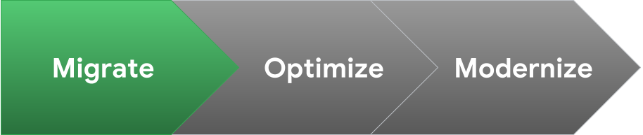

## Migrate

- Deploy the migration infrastructure

  ```
  cd ${GKE_GP_BASE}/terraform/002_migrate && \
  terraform init && \
  terraform plan -input=false -out=tfplan && \
  terraform apply -input=false tfplan && \
  rm tfplan
  ```

  > For more information about the migration infrastructure that is created. see [Migration Infrastructure](docs/migration-infrastructure.md)

### Migrate the database

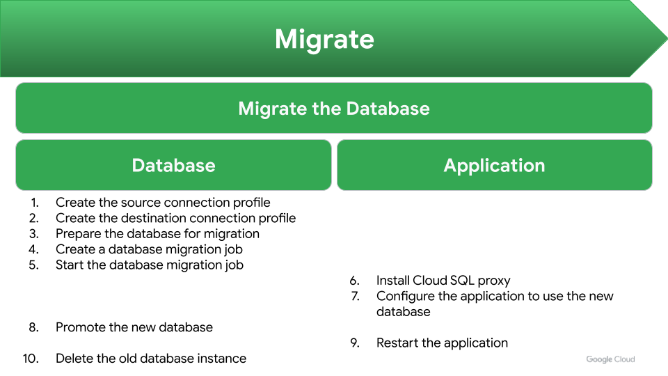

#### Create a source connection profile

- Create the source connection profile

  ```
  LEDGER_DB_HOST=$(gcloud compute instances describe ledger-database --format="value(networkInterfaces[0].networkIP)" --zone=${GKE_GP_ZONE}) && \
  gcloud database-migration connection-profiles create postgresql ledger-database-source \
  --host ${LEDGER_DB_HOST} \
  --password 'password' \
  --port 5432 \
  --region ${GKE_GP_REGION} \
  --username postgres
  ```

  ```
  done: false
  metadata:
    '@type': type.googleapis.com/google.cloud.clouddms.v1.OperationMetadata
    apiVersion: v1
    createTime: 'YYYY-MM-DDTHH:MM:SS.NNNNNNNNNZ'
    requestedCancellation: false
    target: projects/<project-id>/locations/<region>/connectionProfiles/ledger-database-source
    verb: create
  name: projects/<project-id>/locations/<region>/operations/operation-XXXXXXXXXXXXX-XXXXXXXXXXXXX-XXXXXXXX-XXXXXXXX
  ```

- Describe the connection profile

  ```
  gcloud database-migration connection-profiles describe ledger-database-source \
  --region ${GKE_GP_REGION}
  ```

  ```
  createTime: 'YYYY-MM-DDTHH:MM:SS.NNNNNNNNNZ'
  displayName: ledger-database-source
  name: projects/<project-id>/locations/<region>/connectionProfiles/ledger-database-source
  postgresql:
    host: ###.###.###.###
    passwordSet: true
    port: 5432
    ssl: {}
    username: postgres
  state: READY
  updateTime: 'YYYY-MM-DDTHH:MM:SS.NNNNNNZ'
  ```

#### Create a destination connection profile

- Create the destination connection profile

  ```
  gcloud database-migration connection-profiles create cloudsql ledger-database \
  --database-version POSTGRES_14 \
  --private-network default \
  --region ${GKE_GP_REGION} \
  --source-id ledger-database-source \
  --tier db-custom-4-16384
  ```

  ```
  done: false
  metadata:
    '@type': type.googleapis.com/google.cloud.clouddms.v1.OperationMetadata
    apiVersion: v1
    createTime: 'YYYY-MM-DDTHH:MM:SS.NNNNNNNNNZ'
    requestedCancellation: false
    target: projects/<project-id>/locations/<region>/connectionProfiles/ledger-database
    verb: create
  name: projects/<project-id>/locations/<region>/operations/operation-XXXXXXXXXXXXX-XXXXXXXXXXXXX-XXXXXXXX-XXXXXXXX
  ```

- Describe the connection profile

  ```
  gcloud database-migration connection-profiles describe ledger-database \
  --region ${GKE_GP_REGION}
  ```

  ```
  cloudsql:
    cloudSqlId: ledger-database
    settings:
      autoStorageIncrease: true
      databaseVersion: POSTGRES_14
      ipConfig:
        enableIpv4: true
        requireSsl: false
      sourceId: projects/<project-id>/locations/<region>/connectionProfiles/ledger-database-source
      tier: db-custom-4-16384
  createTime: 'YYYY-MM-DDTHH:MM:SS.NNNNNNNNNZ'
  displayName: ledger-database
  name: projects/<project-id>/locations/<region>/connectionProfiles/ledger-database
  provider: CLOUDSQL
  state: CREATING
  updateTime: 'YYYY-MM-DDTHH:MM:SS.NNNNNNZ'
  ```

  > **The `state` needs to be `READY` before the migration can be started, this can take up to 20 minutes.**
  >
  > **You can proceed with the guide, there will be another step to verify the process is complete before starting the migration.**
  >
  > You can monitor the progress with the following:

  ```
  watch --color --interval 5 --no-title "gcloud database-migration connection-profiles describe ledger-database --region ${GKE_GP_REGION} | GREP_COLOR='01;92' egrep --color=always -e '^' -e 'READY'"
  ```

- Progress can also be viewed in the console on the [Cloud SQL](https://console.cloud.google.com/sql/instances) page

  ```
  echo -e "\nCloud SQL ledger-database overview: https://console.cloud.google.com/sql/instances/ledger-database/overview?project=${GKE_GP_PROJECT_ID}\n"
  ```

#### Prepare the database

- Connect to the `ledger-database` instance

  ```
  gcloud compute ssh ledger-database --zone ${GKE_GP_ZONE}
  ```

- Install the pglogical package

  ```
  sudo apt-get install -y postgresql-14-pglogical
  ```

- Configure the database

  ```
  POSTGRESQL_CONF_FILE=${POSTGRESQL_CONF:-/etc/postgresql/14/main/postgresql.conf}
  sudo cp ${POSTGRESQL_CONF_FILE} ${POSTGRESQL_CONF_FILE}.bkp
  ```

  ```
  sudo sed -i "/#wal_level =/c\wal_level = logical                     # minimal, replica, or logical" ${POSTGRESQL_CONF_FILE}
  sudo sed -i "/#wal_sender_timeout =/c\wal_sender_timeout = 0          # in milliseconds; 0 disables" ${POSTGRESQL_CONF_FILE}
  sudo sed -i "/#max_worker_processes =/c\max_worker_processes = 10               # (change requires restart)" ${POSTGRESQL_CONF_FILE}
  sudo sed -i "/#max_replication_slots =/c\max_replication_slots = 10      # max number of replication slots" ${POSTGRESQL_CONF_FILE}
  sudo sed -i "/#max_wal_senders =/c\max_wal_senders = 10            # max number of walsender processes" ${POSTGRESQL_CONF_FILE}
  sudo sed -i "/#shared_preload_libraries =/c\shared_preload_libraries = 'pglogical'  # (change requires restart)" ${POSTGRESQL_CONF_FILE}
  ```

- Verify the changes

  ```
  egrep '^wal_level =|^wal_sender_timeout =|^max_worker_processes =|^max_replication_slots =|^max_wal_senders =|^shared_preload_libraries =' ${POSTGRESQL_CONF_FILE}
  ```

  ```
  max_worker_processes = 10               # (change requires restart)
  wal_level = logical                     # minimal, replica, or logical
  max_wal_senders = 10            # max number of walsender processes
  max_replication_slots = 10      # max number of replication slots
  wal_sender_timeout = 0          # in milliseconds; 0 disables
  shared_preload_libraries = 'pglogical'  # (change requires restart)
  ```

- Restart the database

  ```
  sudo systemctl restart postgresql.service
  ```

- Connect to the database

  ```
  source /opt/monolith/ledgermonolith.env && \
  export PGPASSWORD=${POSTGRES_PASSWORD} && \
  psql --dbname ${POSTGRES_DB} --host ledger-database --username ${POSTGRES_USER}
  ```

- Install the `pglogical` extension

  ```
  CREATE EXTENSION IF NOT EXISTS pglogical;
  \c postgres
  CREATE EXTENSION IF NOT EXISTS pglogical;
  \q
  ```

  Output:

  ```
  postgresdb=# CREATE EXTENSION IF NOT EXISTS pglogical;
  CREATE EXTENSION
  postgresdb=# \c postgres
  SSL connection (protocol: TLSv1.3, cipher: TLS_AES_256_GCM_SHA384, bits: 256, compression: off)
  You are now connected to database "postgres" as user "postgres".
  postgres=# CREATE EXTENSION IF NOT EXISTS pglogical;
  CREATE EXTENSION
  postgres=# \q
  ```

- Logout of the `ledger-database` instance

  ```
  logout
  ```

#### Verify the destination connection profile

- Describe the connection profile

  ```
  gcloud database-migration connection-profiles describe ledger-database --region ${GKE_GP_REGION} | GREP_COLOR='01;92' egrep --color=always -e '^' -e 'READY'
  ```

  ```
  cloudsql:
    cloudSqlId: ledger-database
    settings:
      autoStorageIncrease: true
      databaseVersion: POSTGRES_14
      ipConfig:
        enableIpv4: true
        requireSsl: false
      sourceId: projects/<project-id>/locations/<region>/connectionProfiles/ledger-database-source
      tier: db-custom-4-16384
  createTime: 'YYYY-MM-DDTHH:MM:SS.NNNNNNNNNZ'
  displayName: ledger-database
  name: projects/<project-id>/locations/<region>/connectionProfiles/ledger-database
  provider: CLOUDSQL
  state: READY
  updateTime: 'YYYY-MM-DDTHH:MM:SS.NNNNNNZ'
  ```

  > **The `state` needs to be `READY` before proceeding. If it is not `READY`, you can monitor the progress with the following:**

  ```
  watch --color --interval 5 --no-title "gcloud database-migration connection-profiles describe ledger-database --region ${GKE_GP_REGION} | GREP_COLOR='01;92' egrep --color=always -e '^' -e 'READY'"
  ```

#### Create a Migration Job

- Create the migration job

  ```
  gcloud database-migration migration-jobs create ledger-database-migration \
  --destination ledger-database \
  --region ${GKE_GP_REGION} \
  --source ledger-database-source \
  --type CONTINUOUS
  ```

  ```
  done: false
  metadata:
    '@type': type.googleapis.com/google.cloud.clouddms.v1.OperationMetadata
    apiVersion: v1
    createTime: 'YYYY-MM-DDTHH:MM:SS.NNNNNNNNNZ'
    requestedCancellation: false
    target: projects/<project-id>/locations/<region>/migrationJobs/ledger-database-migration
    verb: create
  name: projects/<project-id>/locations/<region>/operations/operation-XXXXXXXXXXXXX-XXXXXXXXXXXXX-XXXXXXXX-XXXXXXXX
  ```

- Describe the migration job

  ```
  gcloud database-migration migration-jobs describe ledger-database-migration \
  --region ${GKE_GP_REGION}
  ```

  ```
  createTime: 'YYYY-MM-DDTHH:MM:SS.NNNNNNNNNZ'
  destination: projects/<project-id>/locations/<region>/connectionProfiles/ledger-database
  destinationDatabase:
    engine: POSTGRESQL
    provider: CLOUDSQL
  displayName: ledger-database
  duration: ##.######s
  name: projects/<project-id>/locations/<region>/migrationJobs/ledger-database-migration
  source: projects/<project-id>/locations/<region>/connectionProfiles/ledger-database-source
  sourceDatabase:
    engine: POSTGRESQL
  state: STARTING
  type: CONTINUOUS
  updateTime: 'YYYY-MM-DDTHH:MM:SS.NNNNNNZ'
  ```

  > **Wait for the `state` to be `NOT_STARTED` before proceeding. You can monitor the progress with the following:**

  ```
  watch --color --interval 5 --no-title "gcloud database-migration migration-jobs describe ledger-database-migration --region ${GKE_GP_REGION} | GREP_COLOR='01;92' egrep --color=always -e '^' -e 'NOT_STARTED'"
  ```

- Start the migration job

  ```
  gcloud database-migration migration-jobs start ledger-database-migration \
  --region ${GKE_GP_REGION}
  ```

  ```
  done: false
  metadata:
    '@type': type.googleapis.com/google.cloud.clouddms.v1.OperationMetadata
    apiVersion: v1
    createTime: 'YYYY-MM-DDTHH:MM:SS.NNNNNNNNNZ'
    requestedCancellation: false
    target: projects/<project-id>/locations/<region>/migrationJobs/ledger-database-migration
    verb: start
  name: projects/<project-id>/locations/<region>/operations/operation-XXXXXXXXXXXXX-XXXXXXXXXXXXX-XXXXXXXX-XXXXXXXX
  ```

- Describe the migration job

  ```
  gcloud database-migration migration-jobs describe ledger-database-migration \
  --region ${GKE_GP_REGION}
  ```

  ```
  createTime: 'YYYY-MM-DDTHH:MM:SS.NNNNNNNNNZ'
  destination: projects/<project-id>/locations/<region>/connectionProfiles/ledger-database
  destinationDatabase:
    engine: POSTGRESQL
    provider: CLOUDSQL
  displayName: ledger-database
  duration: ##.######s
  name: projects/<project-id>/locations/<region>/migrationJobs/ledger-database-migration
  source: projects/<project-id>/locations/<region>/connectionProfiles/ledger-database-source
  sourceDatabase:
    engine: POSTGRESQL
  state: STARTING
  type: CONTINUOUS
  updateTime: 'YYYY-MM-DDTHH:MM:SS.NNNNNNZ'
  ```

  > **Wait for the `state` to be `RUNNING` and `phase` to be `CDC`. You can monitor the progress with the following:**

  ```
  watch --color --interval 5 --no-title "gcloud database-migration migration-jobs describe ledger-database-migration --region ${GKE_GP_REGION} | GREP_COLOR='01;92' egrep --color=always -e '^' -e 'RUNNING' -e 'CDC'"
  ```

- Progress can also be viewed in the console on the [Database Migrations](https://console.cloud.google.com/dbmigration/migrations) page

  ```
  echo -e "\nDatabase Migration ledger-database-migration: https://console.cloud.google.com/dbmigration/migrations/locations/${GKE_GP_REGION}/instances/ledger-database-migration?project=${GKE_GP_PROJECT_ID}\n"
  ```

- Set the `postgres` database user password

  ```
  gcloud sql users set-password postgres \
  --instance=ledger-database \
  --password='password'
  ```

### Switch the application to use the new database

- Connect to `ledger-service`

  ```
  gcloud compute ssh ledger-service --zone ${GKE_GP_ZONE}
  ```

- Install the Cloud SQL proxy

  ```
  wget https://dl.google.com/cloudsql/cloud_sql_proxy.linux.amd64 -O cloud_sql_proxy
  chmod +x cloud_sql_proxy
  sudo mv cloud_sql_proxy /usr/local/bin
  ```

- Configure Cloud SQL proxy as a service

  ```
  INSTANCE_CONNECTION_NAME=$(gcloud sql instances describe ledger-database --format="value(connectionName)") && \
  cat <<EOF > ~/cloud-sql-proxy.service
  [Unit]
  Description=Cloud SQL Proxy
  Requires=network-online.target
  After=network-online.target

  [Service]
  WorkingDirectory=/usr/local/bin
  ExecStart=/usr/local/bin/cloud_sql_proxy -instances=${INSTANCE_CONNECTION_NAME}=tcp:5432
  Restart=always
  StandardOutput=journal
  User=root

  [Install]
  WantedBy=multi-user.target
  EOF
  sudo mv ~/cloud-sql-proxy.service /etc/systemd/system/cloud-sql-proxy.service && \
  sudo systemctl enable cloud-sql-proxy.service
  ```

- Start the Cloud SQL proxy

  ```
  sudo systemctl start cloud-sql-proxy.service
  sudo systemctl status cloud-sql-proxy.service
  ```

- Change the service's `SPRING_DATASOURCE_URL` configuration value

  ```
  sudo sed -i "/SPRING_DATASOURCE_URL=/c\SPRING_DATASOURCE_URL=\"jdbc:postgresql://127.0.0.1:5432/postgresdb\"" /opt/monolith/ledgermonolith.env
  ```

- Restart the service

  ```
  sudo systemctl restart ledgermonolith
  ```

  > This puts the application into a read-only mode until the next step is completed.

- Logout of `ledger-service`

  ```
  logout
  ```

- Promote the database

  ```
  gcloud database-migration migration-jobs promote ledger-database-migration \
  --region ${GKE_GP_REGION}
  ```

  ```
  done: false
  metadata:
    '@type': type.googleapis.com/google.cloud.clouddms.v1.OperationMetadata
    apiVersion: v1
    createTime: 'YYYY-MM-DDTHH:MM:SS.NNNNNNNNNZ'
    requestedCancellation: false
    target: projects/<project-id>/locations/<region>/migrationJobs/ledger-database-migration
    verb: promote
  name: projects/<project-id>/locations/<region>/operations/operation-XXXXXXXXXXXXX-XXXXXXXXXXXXX-XXXXXXXX-XXXXXXXX
  ```

- Describe the migration job

  ```
  gcloud database-migration migration-jobs describe ledger-database-migration \
  --region ${GKE_GP_REGION}
  ```

  ```
  createTime: 'YYYY-MM-DDTHH:MM:SS.NNNNNNNNNZ'
  destination: projects/<project-id>/locations/<region>/connectionProfiles/ledger-database
  destinationDatabase:
    engine: POSTGRESQL
    provider: CLOUDSQL
  displayName: ledger-database
  duration: ##.######s
  name: projects/<project-id>/locations/<region>/migrationJobs/ledger-database-migration
  phase: PROMOTE_IN_PROGRESS
  source: projects/<project-id>/locations/<region>/connectionProfiles/ledger-database-source
  sourceDatabase:
    engine: POSTGRESQL
  state: RUNNING
  type: CONTINUOUS
  updateTime: 'YYYY-MM-DDTHH:MM:SS.NNNNNNZ'
  ```

  > **Wait for the `state` to be `COMPLETED` before proceeding. You can monitor the progress with the following:**

  ```
  watch --color --interval 5 --no-title "gcloud database-migration migration-jobs describe ledger-database-migration --region ${GKE_GP_REGION} | GREP_COLOR='01;92' egrep --color=always -e '^' -e 'COMPLETED'"
  ```

- Connect to `ledger-service`

  ```
  gcloud compute ssh ledger-service --zone ${GKE_GP_ZONE}
  ```

- Restart the service

  ```
  sudo systemctl restart ledgermonolith
  ```

- Logout of `ledger-service`

  ```
  logout
  ```

- Delete the `ledger-database` instance

  ```
  gcloud compute instances delete ledger-database \
  --quiet \
  --zone ${GKE_GP_ZONE}
  ```

- Output the URL for the application

  ```
  echo -e "\nApplication URL: http://app.endpoints.${GKE_GP_PROJECT_ID}.cloud.goog\n"
  ```

- Got to the URL and verify the application is operational and the balance is the same as before.
- Delete the migration job

  ```
  gcloud database-migration migration-jobs delete ledger-database-migration \
  --quiet \
  --region ${GKE_GP_REGION}
  ```

- Delete the source connection profile

  ```
  gcloud database-migration connection-profiles delete ledger-database-source \
  --quiet \
  --region ${GKE_GP_REGION}
  ```

- Delete the external database connection

  ```
  gcloud sql instances delete ledger-database-master \
  --quiet
  ```

  > This command can throw `ERROR: (gcloud.sql.instances.delete) HTTPError 404: The Cloud SQL instance operation does not exist.`, but the connection will be deleted.

### Migrate the application

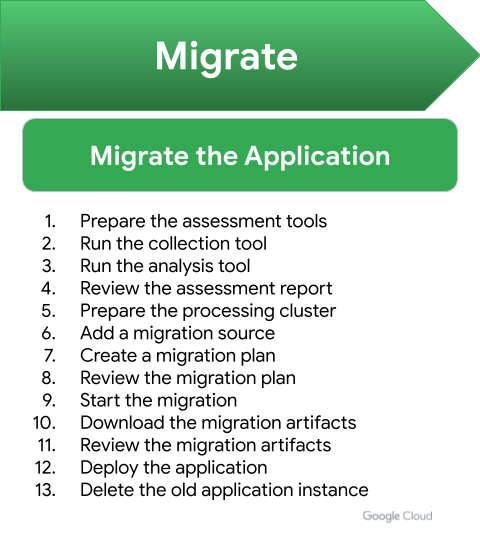

#### Prepare the assessment tools

- Connect to the `ledger-service` instance

  ```
  gcloud compute ssh ledger-service --zone ${GKE_GP_ZONE}
  ```

- Create a directory for the tools

  ```
  mkdir m2c && \
  cd m2c
  ```

- Download the tools

  ```
  MFIT_VERSION=$(curl -s https://mfit-release.storage.googleapis.com/latest) && \
  curl -O "https://mfit-release.storage.googleapis.com/${MFIT_VERSION}/mfit-linux-collect.sh" && \
  chmod +x mfit-linux-collect.sh && \
  curl -O "https://mfit-release.storage.googleapis.com/${MFIT_VERSION}/mfit" && \
  chmod +x mfit
  ```

#### Run the collection tools

- Run the collection tool

  ```
  sudo ./mfit-linux-collect.sh
  ```

  ```
  Collected info saved to: m4a-collect-ledger-service-YYYY-MM-DD-HH-MM.tar
  ```

#### Run the analysis tools

- Run the analysis tool

  ```
  ./mfit report sample m4a-collect-ledger-service-*.tar --format json > ledger-service-mfit-report.json
  ```

  ```
  [✓] Collection completed.
  [+] Assessing fit rules for 1 Assets.
  1 / 1 [-------------------------------------------------------------------------------] 100.00% ? p/s
  ```

- Log out of the `ledger-service` instance

  ```
  logout
  ```

#### Transfer the analysis file

- Transfer the report from the `ledger-service` instance

  ```
  gcloud compute scp \
  ledger-service:~/m2c/ledger-service-mfit-report.json \
  ${GKE_GP_BASE}/migrate/report/ \
  --zone ${GKE_GP_ZONE}
  ```

- Download the report to your local machine

  ```
  cloudshell download ${GKE_GP_BASE}/migrate/report/ledger-service-mfit-report.json
  ```

#### Review the assessment report

- Go to the Migrate to Containers page in the console

  ```
  https://console.cloud.google.com/kubernetes/migrate/migrations
  ```

- Click **OPEN FIT ASSESSMENT REPORT**

- Browser to the `ledger-service-mfit-report.json` file and click **OPEN**

- Open the **Fit Assessment Report** for the `ledger-service`

- Review the **Fit Analysis Results** for **Containerize | Anthos and GKE** and **Containerize | GKE Autopilot**, notice it is an **Excellent fit** for both.

#### Prepare the processing cluster

- Disable the `iam.disableServiceAccountKeyCreation` organization policy if it has not already disabled. Requires the `roles/orgpolicy.policyAdmin` role

  ```
  gcloud resource-manager org-policies disable-enforce iam.disableServiceAccountKeyCreation --project ${GKE_GP_PROJECT_ID}
  ```

- Download the Service Account credentials

  ```
  cd ${GKE_GP_BASE}/migrate/keys
  gcloud iam service-accounts keys create m2c-install.json \
  --iam-account=m2c-install@${GOOGLE_CLOUD_PROJECT}.iam.gserviceaccount.com
  ```

- Get credentials for the processing cluster

  ```
  gcloud container clusters get-credentials processing-cluster --zone ${GKE_GP_ZONE}
  ```

  ```
  Fetching cluster endpoint and auth data.
  kubeconfig entry generated for processing-cluster.
  ```

- Install Migrate to Containers on the `processing-cluster`

  ```
  migctl setup install --json-key=m2c-install.json --version 1.14.0
  ```

  Output:

  ```
  applying resources to the cluster
  ...
  please run 'migctl doctor' to validate your installation status
  ```

- Monitor the status of the Migrate to Containers installation

  ```
  watch --color --interval 5 --no-title "migctl doctor"
  ```

  ```
  [✓] Deployment
  [✓] Docker Registry
  [✓] Artifacts Repository
  [✗] Source Status
      No source was configured. Use 'migctl source create' to define one.
  [✓] Default storage class
  ```

#### Add a migration source

- Download the Service Account credentials

  ```
  cd ${GKE_GP_BASE}/migrate/keys
  gcloud iam service-accounts keys create m2c-gce-source.json \
  --iam-account=m2c-gce-source@${GOOGLE_CLOUD_PROJECT}.iam.gserviceaccount.com
  ```

- Create the source

  ```
  migctl source create ce gce \
  --project ${GOOGLE_CLOUD_PROJECT} \
  --json-key=m2c-gce-source.json
  ```

  ```
  Waiting for Source status
  Source "gce" was created successfully.
  ```

- List the sources

  ```
  migctl source list
  ```

  ```
  Compute Engine sources:
  NAME    STATE   PROJECT
  gce     READY   <project-id>
  ```

- Verify the status of the Migrate to Containers configuration

  ```
  migctl doctor
  ```

  ```
  [✓] Deployment
  [✓] Docker Registry
  [✓] Artifacts Repository
  [✓] Source Status
  [✓] Default storage class
  ```

#### Create a migration

- Stop the virtual machine

  ```
  gcloud compute instances stop ledger-service --zone ${GKE_GP_ZONE}
  ```

- Create a migration plan

  ```
  migctl migration create ledger-service-migration \
  --source gce \
  --type linux-system-container \
  --vm-id ledger-service
  ```

- Check the status of the migration plan

  ```
  migctl migration status ledger-service-migration
  ```

  To see more verbose output , add the `--verbose` flag

  > **When `STEP` is `GenerateMigrationPlan` and `STATUS` is `Completed`, the migration plan is complete. You can monitor the progress with the following:**

  ```
  watch --color --interval 5 --no-title "migctl migration status ledger-service-migration | GREP_COLOR='01;92' egrep --color=always -e '^' -e 'GenerateMigrationPlan[[:space:]]+Completed'"
  ```

- The status of the migration can also be viewed on the [Migrate to Containers](https://console.cloud.google.com/kubernetes/migrate/migrations) page

  ```
  echo -e "\nMigrations: https://console.cloud.google.com/kubernetes/migrate/migrations?project=${GKE_GP_PROJECT_ID}\n"
  ```

  ```
  echo -e "\nledger-service-migration Status: https://console.cloud.google.com/kubernetes/migrate/migration/${GKE_GP_ZONE}/processing-cluster/v2k-system/ledger-service-migration/status\n"
  ```

- Start the virtual machine

  ```
  gcloud compute instances start ledger-service --zone ${GKE_GP_ZONE}
  ```

#### Review the migration plan

- Download the migration plan

  ```
  cd ${GKE_GP_BASE}/migrate/plan
  migctl migration get ledger-service-migration
  ```

- Review the `ledger-service-migration.yaml` file

- Add the following to end of the `ledger-service-migration.yaml` file

  ```
  cat <<EOF >> ledger-service-migration.yaml
    endpoints:
    - name: ledger-service
      port: 8080
      protocol: TCP
    logPaths:
    - appName: ledger-service
      globs:
      - /var/log/monolith.log
  EOF
  ```

- Update the migration plan

  ```
  migctl migration update ledger-service-migration --main-config ledger-service-migration.yaml
  ```

  ```
  MigrationPlan updated for Migration ledger-service-migration. Please run `migctl migration generate-artifacts ledger-service-migration` to proceed.
  ```

#### Execute the migration

- Start the migration

  ```
  migctl migration generate-artifacts ledger-service-migration
  ```

- Check the status of the migration

  ```
  migctl migration status ledger-service-migration
  ```

  To see more verbose output , add the `--verbose` flag

  > **When `STEP` is `GenerateArtifacts` and `STATUS` is `Completed`, the migration is complete. You can monitor the progress with the following:**

  ```
  watch --color --interval 5 --no-title "migctl migration status ledger-service-migration | GREP_COLOR='01;92' egrep --color=always -e '^' -e 'GenerateArtifacts[[:space:]]+Completed'"
  ```

- The status of the migration can also be viewed on the [Migrate to Containers](https://console.cloud.google.com/kubernetes/migrate/migrations) page

  ```
  echo -e "\nledger-service-migration Status: https://console.cloud.google.com/kubernetes/migrate/migration/${GKE_GP_ZONE}/processing-cluster/v2k-system/ledger-service-migration/status\n"
  ```

#### Review the generated artifacts

- Download the artifacts

  ```
  cd ${GKE_GP_BASE}/migrate/artifacts
  migctl migration get-artifacts ledger-service-migration
  ```

- Review the artifacts

  - artifacts.yaml
  - blocklist.yaml
  - deployment_spec.yaml

    - Set the container to use the `backend` Kubernetes service account

      ```
      sed -i '/        resources: {}/a \
            serviceAccountName: backend' ${GKE_GP_BASE}/migrate/artifacts/deployment_spec.yaml
      ```

    - Set the container resource requests and limits based on instance size

      ```
      sed -i '/        resources: {}/c \
              resources:\
                limits:\
                  cpu: 4000m\
                  ephemeral-storage: 10Gi\
                  memory: 16Gi\
                requests:\
                  cpu: 4000m\
                  ephemeral-storage: 10Gi\
                  memory: 16Gi' ${GKE_GP_BASE}/migrate/artifacts/deployment_spec.yaml
      ```

  - Dockerfile
  - logs.yaml
  - migration.yaml
  - services-config.yaml
  - skaffold.yaml
  - tempfiles.yaml

#### Deploy the application

- Get credentials for the application cluster

  ```
  gcloud container clusters get-credentials application-cluster \
  --region ${GKE_GP_REGION}
  ```

- Deploy the migrated service

  ```
  kubectl --namespace application apply -f deployment_spec.yaml
  ```

- Wait for the deployment to be ready

  ```
  kubectl --namespace application wait deployment ledger-service --for condition=available --timeout=300s
  ```

- Edit the ConfigMap to point to the new service

  ```
  kubectl --namespace application edit configmap service-api-config
  ```

  Change `ledger-service.<zone>.c.<project-id>.internal` to `ledger-service`

  ```
  data:
    BALANCES_API_ADDR: ledger-service:8080
    CONTACTS_API_ADDR: contacts:8080
    HISTORY_API_ADDR: ledger-service:8080
    TRANSACTIONS_API_ADDR: ledger-service:8080
    USERSERVICE_API_ADDR: userservice:8080
  ```

- Restart the `frontend` service

  ```
  kubectl --namespace application rollout restart deploy frontend
  ```

- Wait for the rollout to complete

  ```
  kubectl --namespace application rollout status deployment frontend --watch
  ```

- Output the URL for the application

  ```
  echo -e "\nApplication URL: http://app.endpoints.${GKE_GP_PROJECT_ID}.cloud.goog\n"
  ```

- Got to the URL and verify the application is operational and the balance is the same as before.

- Stop the virtual machine where the application was running

  ```
  gcloud compute instances stop ledger-service --zone ${GKE_GP_ZONE}
  ```

- Got to the URL and verify the application remains operational and the balance is the same as before.

- Delete the `ledger-service` instance

  ```
  gcloud compute instances delete ledger-service \
  --delete-disks all \
  --quiet \
  --zone ${GKE_GP_ZONE}
  ```

### New Architecture

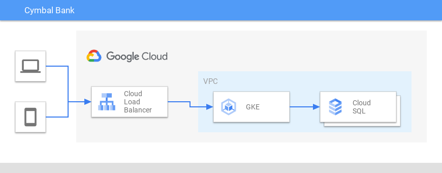

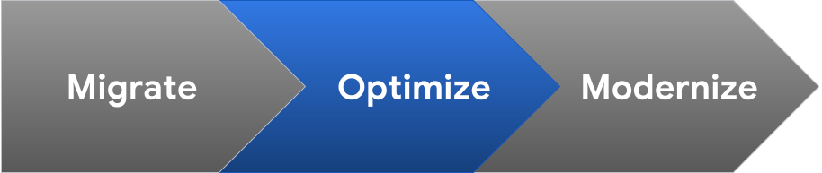

## Optimize

### Optimize the application

#### Analyze resource utilization

- Go to the [Kubernetes Engine Workloads](https://console.cloud.google.com/kubernetes/workload/overview) page in the console

  ```
  echo -e "\Kubernetes Engine Overview: https://console.cloud.google.com/kubernetes/workload/overview?project=${GKE_GP_PROJECT_ID}\n"
  ```

- Click on the **ledger-service** workload

  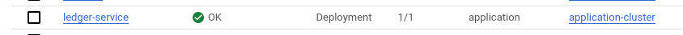

- Click on **ACTIONS** at the top

  

- Select **Scale** and click **Edit resource requests**

  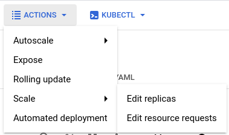

- Review the CPU and Memory utilization of the workload

  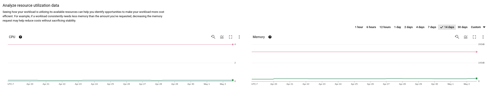

#### Rightsizing the resource requests and limits

After reviewing the CPU and Memory utilization of the workload you will notice that the current request and limit are much higher than what the workload has been utilizing.
Based on the utilization data, GKE can make a suggestion as to what value to set for the resource request and limit.

- In the **Adjust resource requests and limits** section you can see the current resource request and limit values along with the latest suggestion values.

  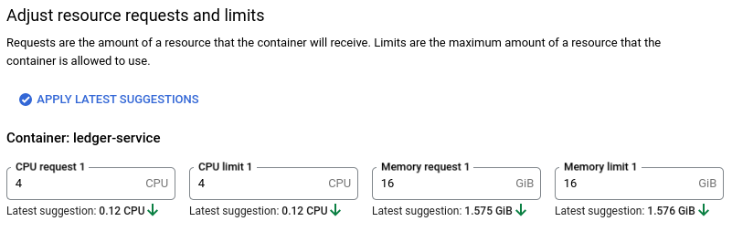

  > Latest suggestions are based on your workload's latest usage patterns. See your workload's resource utilization data to determine if the latest suggestions are the best fit for your workload.

- Set the new request and limit values

  | Attribute        | Value |
  | ---------------- | ----- |
  | CPU request 1    | 0.5   |
  | CPU limit 1      | 0.5   |
  | Memory request 1 | 2     |
  | Memory limit 1   | 2     |

  > Notice that a warning message is displayed regarding workloads running on autopilot clusters. Autopilot enforces minimum, maximum, and CPU to memory ratios for resources.
  > When the suggested values are applied, the values may be modified to maintain these ratios and the step increments.
  > See [Resource requests in Autopilot](https://cloud.google.com/kubernetes-engine/docs/concepts/autopilot-resource-requests) for additional information.

- Click **SAVE CHANGES**

  > You will be prompted to confirm that you want to save the changes and informed about possible disruption to your workload.
  > We will cover [disruption budgets](https://cloud.google.com/architecture/best-practices-for-running-cost-effective-kubernetes-applications-on-gke#add-pod_disruption_budget-to-your-application)
  > in the **Modernize** phase of this guide.

- Click **CONFIRM** to apply the changes to the workload

### Optimize the database

#### Cloud SQL Monitoring Metrics

Cloud SQL provides out of the box metrics for each instance.

- Go to the [Cloud SQL Instances](https://console.cloud.google.com/sql/instances) page in the console

  ```
  echo -e "\nCloud SQL Instances: https://console.cloud.google.com/sql/instances?project=${GKE_GP_PROJECT_ID}\n"
  ```

- Click the checkbox to the left of the `ledger-database` instance

  

- Review the metrics in the panel on the right side of the page

  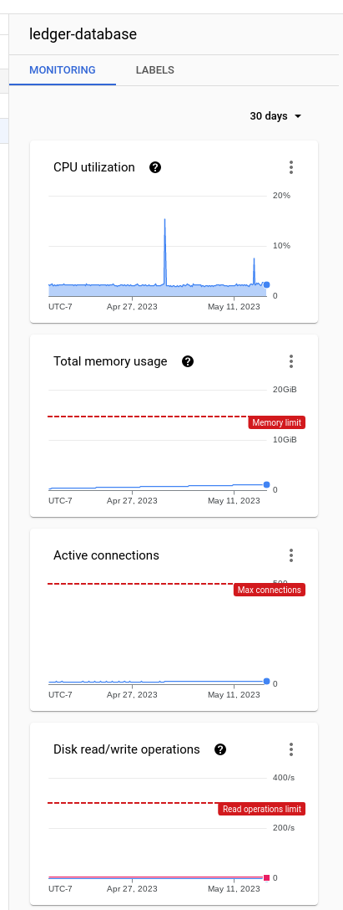

- The metrics interval that is displayed can be adjust using the dropdown

  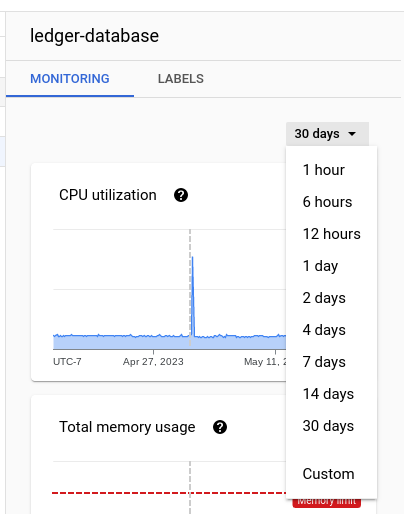

#### Cloud SQL System Insights

Cloud SQL has a System Insights page that provides a consolidated view of monitoring metrics for an instance.

- Go to the `ledger-database` [Cloud SQL System Insights](https://console.cloud.google.com/sql/instances/ledger-database/system-insights) page in the console

  ```
  echo -e "\nledger-database Cloud SQL System Insights: https://console.cloud.google.com/sql/instances/ledger-database/system-insights?project=${GKE_GP_PROJECT_ID}\n"
  ```

- Review the metrics

  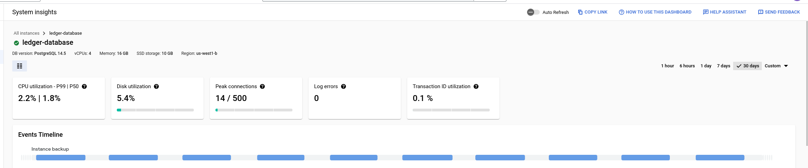

- The metrics interval that is displayed can be adjust using the selector in the upper right

  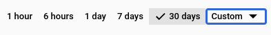

#### Cloud SQL Recommendations

[Recommender](https://cloud.google.com/recommender/docs/overview) is a service that provides recommendations and insights for using resources on Google Cloud. These recommendations and insights are per-product or per-service, and are generated based on heuristic methods, machine learning, and current resource usage. Cloud SQL has a set of cost and performance [recommenders](https://cloud.google.com/recommender/docs/recommenders) that can assist with optimizing your Cloud SQL instances. The recommendations are available via the console and `gcloud recommender`.

#### Rightsizing the database instance

Based on the monitoring metrics and system insights, we can see that our Cloud SQL instances is overprovisioned. We can adjust the instance size to optimize our utilization.

- Patch the `ledger-database` instance's tier

  ```
  gcloud sql instances patch ledger-database \
  --tier db-custom-2-8192
  ```

  ```
  The following message will be used for the patch API method.
  {"name": "ledger-database", "project": "<project-id>", "settings": {"tier": "db-custom-2-8192"}}
  WARNING: This patch modifies a value that requires your instance to be restarted. Submitting this patch will immediately restart your instance if it's running.

  Do you want to continue (Y/n)?  Y

  Patching Cloud SQL instance...done.
  Updated [https://sqladmin.googleapis.com/sql/v1beta4/projects/<project-id>"/instances/ledger-database].
  ```

  > While the instances is updated it will be in a read-only state. This operations should be performed during a maintenance window or scheduled downtime.

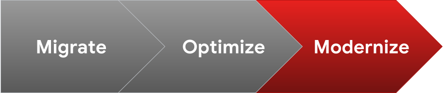

## Modernize

Modernizing an application can take many forms, from tuning an application to run more efficiently on modern infrastructure to breaking an application down into microservices to moving the application into a fully automated software delivery life cycle. In this guide, we will discuss some of the various design and architecture decisions that should be taken into consideration when deciding to modernize an application.

The first step in modernizing an application is to assess its current state. This includes understanding the application's architecture, its current performance, and its security posture. Once you have a good understanding of the application's current state, you can begin to identify areas where modernization can improve the application's performance, security, or scalability.

There are many different ways to modernize an application. Some common approaches include:

- Migrating the application to a new programming language or framework
- Refactoring the application to improve its performance or scalability
- Decomposing the application into microservices
- Automating the application's deployment and testing

The best approach for modernizing an application will depend on the specific needs of the application and the organization.

Once you have chosen an approach, you will need to make a number of design and architecture decisions. These decisions will impact the overall architecture of the modernized application, as well as its performance, security, and scalability.

Some of the key design and architecture decisions that you will need to make include:

- The choice of programming language and framework
- The choice of cloud platform
- The choice of deployment architecture
- The choice of security mechanisms
- The choice of monitoring and logging tools

These decisions should be made in consultation with the application's stakeholders, including developers, architects, and security professionals.

Modernizing an application can be a complex and challenging process. However, by carefully considering the design and architecture decisions, you can ensure that the modernized application meets the needs of the organization.

### Scaling and Resiliency

Now that our application has been running in GKE and we have metrics regarding its performance, we can consider using [replicas](https://kubernetes.io/docs/concepts/workloads/controllers/replicaset/). Replicas ensure the redundancy of your workloads for improved performance and responsiveness, and to avoid a single point of failure. They can be used to control the number of pod replicas running at any given time. Together with [Horizontal Pod Autoscaling (HPA)](https://kubernetes.io/docs/tasks/run-application/horizontal-pod-autoscale/), the cluster can automatically scale the workload to match demand.

Kubernetes offers features to help you run highly available applications even when you introduce frequent voluntary disruptions. As an application owner, you can create a [PodDisruptionBudget (PDB)](https://kubernetes.io/docs/tasks/run-application/configure-pdb/) for each application. A PDB limits the number, or percentage, of Pods of a replicated application that are down simultaneously from voluntary disruptions. For example, a web front end might want to ensure that the number of replicas serving load never falls below a certain percentage of the total. With PDB configured, Kubernetes will drain a node following the configured disruption schedule and new pods will be deployed on other available nodes. This approach ensures Kubernetes schedules workloads in an optimal way while controlling the disruption based on the PDB configuration.

Sometimes, pods can be [disrupted](https://kubernetes.io/docs/concepts/workloads/pods/disruptions/) unexpectedly. Kubernetes manage the shutdown process with [Lifecycle Hook](https://kubernetes.io/docs/concepts/containers/container-lifecycle-hooks/). By default, the [termination](https://kubernetes.io/docs/concepts/workloads/pods/pod-lifecycle/#pod-termination) grace period is 30 seconds. This should be sufficient for most lightweight, cloud-native applications. However this might be too low for heavier applications or applications that have long shutdown processes. It is recommended that you evaluate your existing grace periods and tune them based on the specific needs of your architecture and application. You can change the termination grace period by altering `terminationGracePeriodSeconds` in the manifest.

### Images

In this guide we used Migrate to Containers to create the image for our application. For some types of workloads, Migrate to Containers can create some large sized images that are somewhat static. Depending on the level of continued engineering that will go into the application in the future, there are several approaches that can be taken to improve the image.

In the event that a CI/CD pipeline is already in place to produce a deployable artifact for the application, the Migrate to Containers image can be modified to pull in the produced artifact. This allows the application to be developed in much the same way, but with the benefit of being containerized, with minimal effort.

If the application is going to be actively developed, it might be worth considering a smaller, more workload specific base image for the application. A smaller image has security, performance, reliability, efficiency, and maintainability advantages that improve the overall development and deployment experience. This process involves creating a suitable base image that can be managed and maintained to meet your organization's requirements. Typically the whole build process for the application is containerized with a multi stage build utilizing either a builder and/or runtime image. This has the added benefit of centralizing all of the build logic.

## Cleanup Migration Infrastructure

- Enable the `iam.disableServiceAccountKeyCreation` organization policy if it was disabled. Requires the `roles/orgpolicy.policyAdmin` role

  ```
  gcloud resource-manager org-policies enable-enforce iam.disableServiceAccountKeyCreation --project ${GKE_GP_PROJECT_ID}
  ```

- Destroy the migration infrastructure

  ```
  cd ${GKE_GP_BASE}/terraform/002_migrate && \
  terraform init && \
  terraform destroy -auto-approve
  ```

## Cleanup Project and Repository

- Delete the `ledger-database` Cloud SQL instance

  ```
  gcloud sql instances delete ledger-database \
  --quiet
  ```

- Destroy the application infrastructure

  ```
  cd ${GKE_GP_BASE}/terraform/001_application && \
  terraform init && \
  terraform destroy -auto-approve
  ```

  > Delete any orphaned GCE disks if failing to disable `compute.googleapis.com`

- Reset the repository

  ```
  ${GKE_GP_BASE}/scripts/reset_repo.sh
  ```

## Troubleshooting

See [Troubleshooting](docs/troubleshooting.md)
